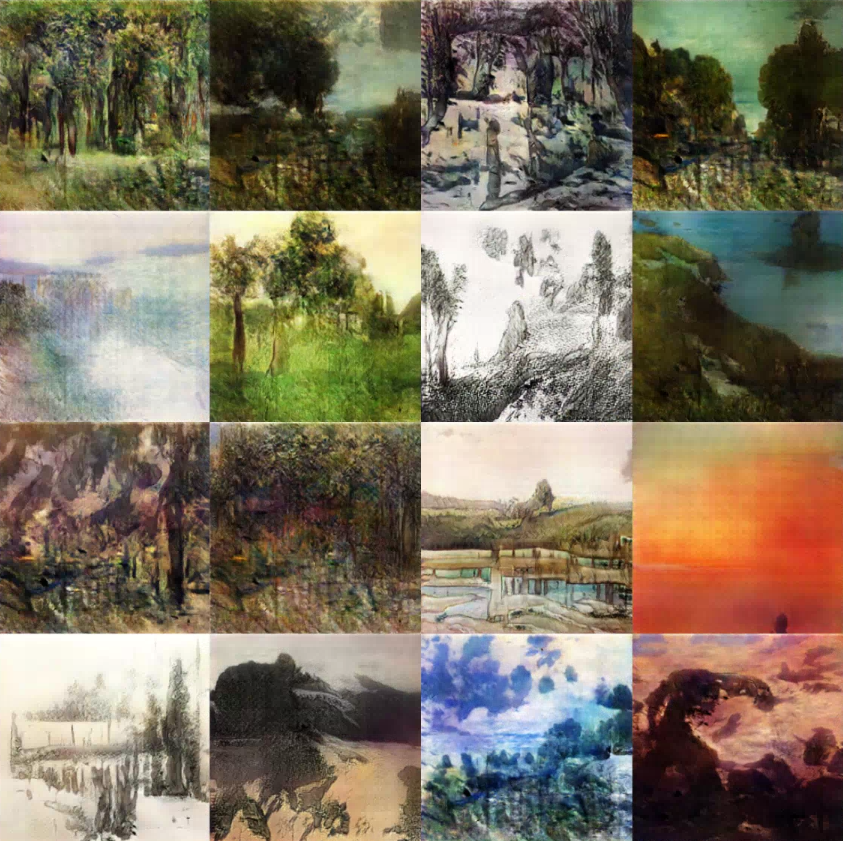

# DCGAN for Art

Fork of [Deep Convolutional Generative Adversarial Networks](https://github.com/carpedm20/DCGAN-tensorflow) with a focus on generating art.

Additional layer added in both generator and discriminator to create higher resolution output pictures.

Art was downloaded from the dataset listed [here]()

## Usage
Identical to the original with a few additional optional flags.
Specifically, there is now the option to specify the dimension of gen/discrim filters in first convolutional layer, as well as the option of whether the generator should update twice for every discriminator update.

## Results
Landscape GAN:

More results coming!
## Author

Daniel Zhou / [@danosaur98](www.github.com/danosaur98)
