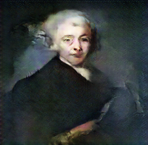

# DCGAN for Art

Fork of [Deep Convolutional Generative Adversarial Networks](https://github.com/carpedm20/DCGAN-tensorflow) with a focus on generating art.

## Differences from original 

* Added an additional layer to discriminator, generator and sampler

* Added additional flags
    * specifying number of filters in discriminator and generator, 
    * specifying distribution of z noise (uniform vs normal)
    * specifying whether generator should be updated twice for every discriminator update
    
* Added file for cleaning image data
    * Resizes and converts grayscale and RGBY images to RGB

## Usage

Art was downloaded from the dataset listed [here](https://github.com/rkjones4/GANGogh)

The data folder should follow this structure:
```
data 
│
└───abstract
│   │   0.png
│   │   1.png
│   │   ...
│
└───cityscape
│   │   0.png
│   │   1.png
│   │   ...
│
└───landscape
│   │   0.png
│   │   1.png
│   │   ...  
│
└───portrait
│   │   0.png
│   │   1.png
│   │   ... 
```

Sample usage:
```buildoutcfg
python main.py --train --dataset=landscape  --data_dir=images_256/ --input_height=256 --output_height=256 --df_dim=40 --gf_dim=160 --double_update_gen=False
```

## Results
Landscape GAN:

 
 
 
 


Portrait GAN:

 
 
 
 
 


More results coming!

## Author

Daniel Zhou 

## Credits

* [Deep Convolutional Generative Adversarial Networks](https://github.com/carpedm20/DCGAN-tensorflow) for architecture, sampling, etc.
* [GANGoh](https://github.com/rkjones4/GANGogh) for data / image resizing
* [art-DCGAN](https://github.com/robbiebarrat/art-DCGAN) for some hyperparameters
* [Duke + Data Science](https://plus.datascience.duke.edu/) for hosting art competition and letting me use GPUs
